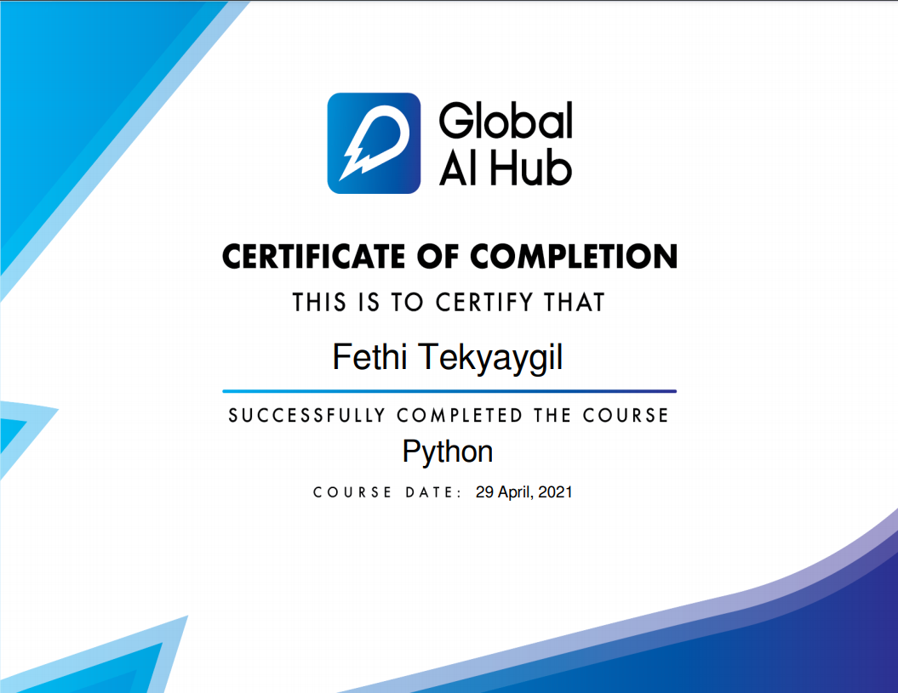

    

# Welcome to our Introduction to Python Programming Course Repo!

You can find more information about our Introduction to Machine Learning Course by visiting [Course Website.](https://globalaihub.com/courses/introduction-to-python-turkish/lessons/python-kursuna-hosgeldiniz/)

## Syllabus

### [Lesson 1](https://github.com/gaih/introduction_to_python_v2/blob/master/Introduction%20to%20Python%20-%20Day%201.ipynb)
- Veri Tipleri
- Sayılar (Numbers)
- Değişkenler (Variables)
- Stringler (Strings)
- Mantıksal Operatörler ve Boolean
- Listeler (Lists)
- Sözlükler (Dictionaries)

### [Lesson 2](https://github.com/gaih/introduction_to_python_v2/blob/master/Introduction%20to%20Python%20-%20Day%202.ipynb)
- Koşullar
- Operatörler
- Koşul Durumlar
- Döngüler
- For Döngüsü (For Loop)
- While Döngüsü (While Loop)

### [Lesson 3](https://github.com/gaih/introduction_to_python_v2/blob/master/Introduction%20to%20Python%20-%20Day%203.ipynb)
- Fonksiyonlar
- Argümanlar ve Parametreler (Arguments and Parameters)
- return
- Scope
- Moduller
- Methodlar
- Exceptions
- Exception Handling

## Certificate

